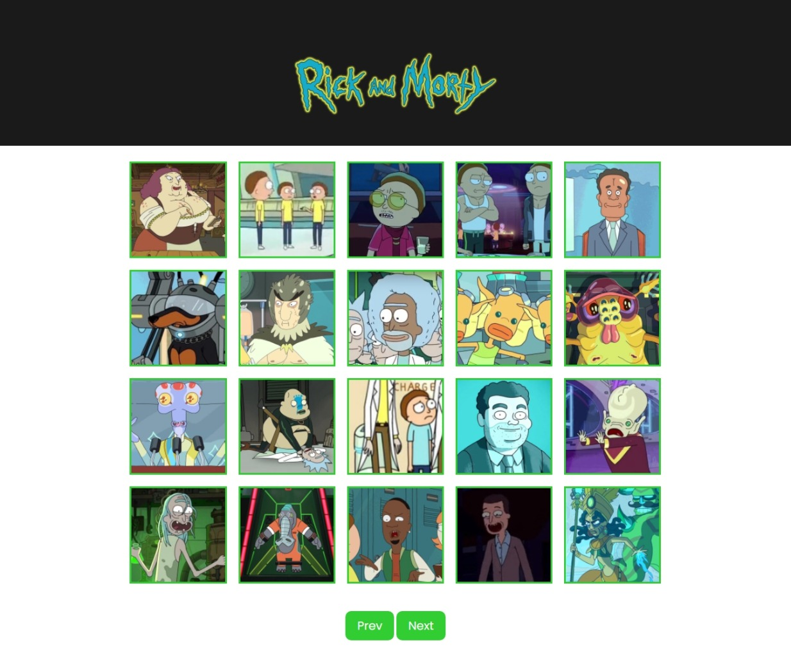

<h1 align=" center"> 
    Rick and Morty 👓
</h1>

<h1>
    
</h1>

<h2 align="center">
    <a href="https://matheusnlourenco.github.io/projeto-js-apiRickAndMorty//">Ver projeto</a>
</h2>
<h2>🚨 Sobre </h2>

Projeto rick and morty. Feito com js vanilla consumindo API rick and morty para pegar os personagens mostrar no front-end..

<h2>🔨 Ferramentas </h2>

- HTML
- CSS
- JAVASCRIPT
- API Rick and Morty
